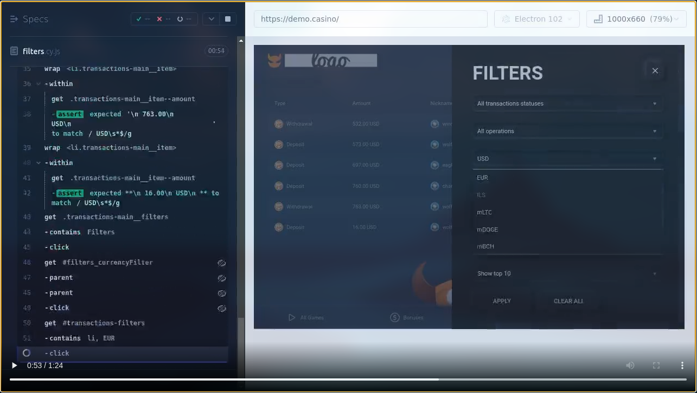

[](https://github.com/prettier/prettier)

# Base project: Cypress + Javascript

Basic example of using Cypress with Javascript.

# Table of contents

* [Overview](#overview)
* [Get started](#get-started)
  * [Installation](#installation)
* [How to run the tests](#how-to-run-the-tests)
  * [Running tests](#running-tests)
  * [Running tests manually](#running-tests-manually)
* [Static code analysis tools](#static-code-analysis-tools)
  * [ESLint](#eslint)
    * [Find Problems](#find-problems)
    * [Fix Automatically](#fix-automatically)
* [License](#license)

# Overview

Automate the ["user registration"](cypress/e2e/1-registration/create-acount.cy.js) and ["transaction filtering"](cypress/e2e/2-transactions/filters.cy.js) feature of the https://demo.casino site.

# Get started

## Installation

```bash
npm install
```

## Configuration

An `.env` file is required in the project base directory, this file will contain the credentials required to test registration and login to the site.

```bash
# file: .env

# required to create new accounds
CYPRESS_API_KEY=<MAILSLURP_API_KEY>

# required for transactions tests
CYPRESS_USERNAME=<DEMO_CASINO_USERNAME>
CYPRESS_PASSWORD=<DEMO_CASINO_PASSWORD>

```

How to obtain these values?:
- `MAILSLURP_API_KEY`: register at [MailSlurp](https://app.mailslurp.com/sign-up/) and get a free **API KEY** (limited use). MailSlurp provides fake email address creators for throwaway email accounts that can be used for end-to-end application testing.
- `DEMO_CASINO_USERNAME` and `DEMO_CASINO_PASSWORD`: register at [Demo Casino](https://demo.casino/user/registration).

# How to run the tests

## Running tests

```bash
npm test
```


### Cypress videos

#### create-acount.cy.js


#### filters.cy.js

[](documentation/media/cypress/2-transactions/filters.cy.js.mp4)


## Running tests manually

Open **`Cypress`** and run the tests manually:

```bash
npm run cypress:open
```

# Static code analysis tools

## ESLint

### Find Problems

ESLint statically analyzes the code to find problems.

```bash
npm run lint
```

### Fix Automatically

Many problems ESLint finds can be automatically fixed.

```bash
npm run lint:fix
```

# License

[MIT](./LICENSE)
